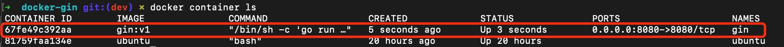

`## 项目介绍
本项目主要用于测试在docker中构造gin环境

### 构造镜像
```
 docker build -t gin:v1 .  
```
查看镜像
```
docker images
```
查看结果如下


### 运行容器
```
docker run -d --name gin -p 8080:8080 gin:v1
```
查看运行的容器
```
docker container ls 
```
查看结果如下


### 测试
```
curl localhost:8080
```
返回结果为hello world则说明配置成功